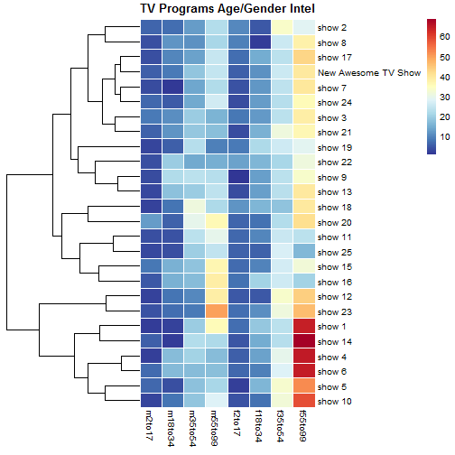

Smart TV Program Scheduler
========================================================
author: Tianzi Harrison
date: Fri Jun 19 11:32:15 2015
transition: rotate

Background
========================================================
In my line of work as an audience research analyst, I often
need to make scheduling recommendations for a new show
based on its estimated age and gender skew information.

While coming up with reliable estimates for a show is a
topic on its own, using those estimates to plan its place
in the chaotic competitive landscape can be challenging.

My first Shiny App named **Smart TV Program Scheduler** aims
to overcome this challenge, using simulated TV audience data.

Simulate Data
========================================================
A total of *50* shows with *8* demographic groups are simulated
in this App. Here are the first *6* shows with their corresponding
male demographic group information.


```r
data[1:6, 1:4]
```

```
        m2to17   m18to34  m35to54  m55to99
show1 1.295015  1.947709 18.84203 35.26568
show2 5.703965  6.637298 12.14353 22.01264
show3 8.100790 10.626807 18.84957 15.21692
show4 1.586598 16.592996 20.02630 16.74080
show5 6.154500  3.276556 17.46174 20.72195
show6 6.382986 16.362503 16.55561 16.92699
```

Preferred Method: hierarchical clustering
========================================================
The App makes an intial plot using the existing shows. Sliders
in the App compile user-input data for a new TV show. Once the
user hits Submit, the App runs a clustering method to group
the new show with the existing shows.

This clustering method is known as ~~hierarchical clustering~~.
There are other clustering methods available through R, such
as ~~K-means clustering~~.  However, hierarchical clustering seems
to produce the most stable and reliable outcome.

Sample Plot (reduced dimension)
========================================================
 
